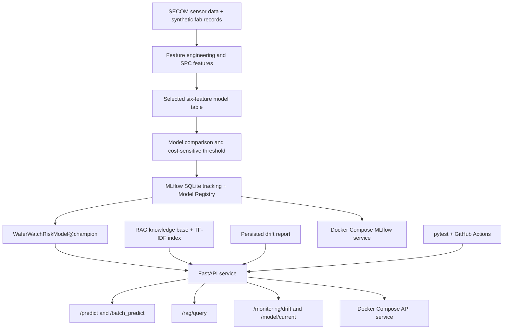

# WaferWatch System Architecture

## 1. Purpose

WaferWatch is a local production-style prototype for cost-sensitive lot
escalation and evidence-grounded RCA triage.

The system combines selected SPC-enhanced sensor features, an MLflow-registered
risk model, FastAPI inference endpoints, local RAG retrieval, drift monitoring,
Docker Compose, pytest, and GitHub Actions.



## 2. Data and Feature Layer

The supervised deployment model uses these selected SPC-enhanced features:

- `sensor_mean`
- `sensor_std`
- `sensor_min`
- `sensor_max`
- `spc_violation_count`
- `spc_max_abs_zscore`

The selected feature table is:

```text
data/processed/demo_spc_selected_feature_table.csv
```

The current champion is Logistic Regression. It was selected from the
deployment-eligible supervised candidates using evaluation metrics first and
serialized artifact size as the deterministic tie-breaker.

## 3. Cost-Sensitive Decision Layer

The API uses the champion-specific threshold report:

```text
reports/spc_selected_thresholding_report.json
```

Current decision threshold:

```text
0.05
```

Decision rule:

- `risk_score >= threshold` → `Escalate for engineer review`
- `risk_score < threshold` → `Release / monitor`

The threshold is a decision-support setting based on the project cost
assumptions. It is not a confirmed physical process rule.

## 4. MLflow Tracking and Model Registry

Local MLflow runtime state is intentionally excluded from Git:

```text
mlflow_data/
├── mlflow.db
└── artifacts/
```

The registered model configuration is:

| Field | Value |
|---|---|
| Registered model | `WaferWatchRiskModel` |
| Champion alias | `champion` |
| Champion version | `2` |
| Champion run ID | `f5a232b57a0841bd9c8c5a533ccc2ab9` |

`src/mlops/register_models.py` logs the supervised candidates, selects the
champion, registers it, assigns the alias, and verifies that the alias resolves
to the expected version and run ID.

## 5. FastAPI Service

FastAPI entry point:

```text
src/api/main.py
```

| Endpoint | Purpose |
|---|---|
| `GET /` | Service identification |
| `GET /health` | Service liveness check |
| `GET /model/current` | Current Registry champion metadata |
| `POST /predict` | One-lot risk score and escalation decision |
| `POST /batch_predict` | Ordered batch scoring with shared champion metadata |
| `POST /rag/query` | Evidence-grounded RCA triage answer |
| `GET /monitoring/drift` | Latest persisted feature-drift report |

`/predict` and `/batch_predict` validate the exact six required feature names.
Unexpected or missing features return HTTP 422 rather than silently changing
the model input.

`/rag/query` defaults to deterministic local generation. OpenAI generation is
only used when the caller explicitly sets `generation_mode` to `openai`.

## 6. RAG Safety Controls

The RAG subsystem uses a local TF-IDF index and fixed answer structure.

It enforces:

- retrieval before generation;
- evidence IDs in answers;
- abstention when evidence is insufficient;
- separation between observed evidence and suspected issue;
- a limitation statement that does not claim physical causality.

The local RAG index is:

```text
data/processed/rag_tfidf_index.json
```

## 7. Monitoring Layer

Drift monitoring compares a reference and current feature distribution using:

- Population Stability Index;
- standardized mean shift;
- missing-rate shift;
- feature-level drift flags.

The API returns the persisted report:

```text
reports/drift_monitoring_report.json
```

A drift alert indicates distribution change and should trigger performance
review when labels become available. It does not by itself prove model failure
or process root cause.

## 8. Container Runtime

`Dockerfile` packages the FastAPI service with Python 3.12.

`docker-compose.yml` starts:

- `mlflow`: local MLflow tracking and Registry service on port `5000`;
- `api`: WaferWatch FastAPI service on port `8000`.

The Compose API resolves the champion alias from MLflow Registry. For this local
Windows-to-Linux Compose prototype, it loads the selected MLflow 3 model
artifact from the mounted `mlflow_data/artifacts` path after resolving the
Registry metadata. This preserves the existing Version 2 registration without
re-registering the model.

Run locally:

```powershell
docker compose up --build
```

Health check:

```powershell
Invoke-RestMethod http://127.0.0.1:8000/health
```

Stop services:

```powershell
docker compose down
```

## 9. Automated Tests and CI

Local API tests are in:

```text
tests/test_api.py
```

They mock MLflow and RAG runtime dependencies so tests run without a live
MLflow server or OpenAI API key.

Pytest configuration:

```text
pytest.ini
```

GitHub Actions workflow:

```text
.github/workflows/pytest.yml
```

The workflow installs project dependencies on Python 3.12 and runs:

```text
pytest -q
```

The current workflow has passed with 8 tests.

## 10. Scope Boundary

This is a local production-style prototype.

It does not include:

- cloud deployment;
- Airflow or other workflow orchestration;
- automatic retraining;
- automatic production release;
- automatic root-cause confirmation.

Model outputs, drift alerts, and RAG answers remain decision-support artifacts
for human engineering review.